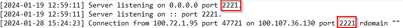

# An unusual sighting

First of all connect to the server with netcat.

### What is the IP Address and Port of the SSH Server (IP:PORT)

Open sshd.log and find first connection and compare distenation port with listening port.



#### Answer : 100.107.36.130:2221

### What time is the first successful Login

Looking for the first "Starting session".

```log
[2024-02-13 11:29:50] Starting session: shell on pts/2 for root from 100.81.51.199 port 63172 id 0
```

#### Answer : 2024-02-13 11:29:50

### What is the time of the unusual Login

Well after analysis we found, that was only one strange connection around 4 AM.

```log
[2024-02-19 04:00:14] Accepted password for root from 2.67.182.119 port 60071 ssh2
```

### Answer : 2024-02-19 04:00:14

### What is the Fingerprint of the attacker's public key

Here we just looking at line above.

```log
[2024-02-19 04:00:14] Failed publickey for root from 2.67.182.119 port 60071 ssh2: ECDSA SHA256:OPkBSs6okUKraq8pYo4XwwBg55QSo210F09FCe1-yj4
```

#### Answer : OPkBSs6okUKraq8pYo4XwwBg55QSo210F09FCe1-yj4

### What is the first command the attacker executed after logging in

Open bash_history.txt and find first command, that was executed around 4 am.

```log
[2024-02-19 04:00:18] whoami
```

#### Answer : whoami

### What is the final command the attacker executed before logging out

Here the same process, but find the last command, that was executed around 4 am.

```log
[2024-02-19 04:14:02] ./setup
```

#### Answer : ./setup

## Flag : HTB{B3sT_0f_luck_1n_th3_Fr4y!!}
