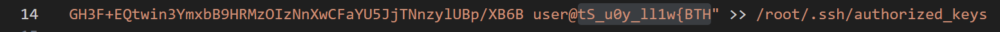
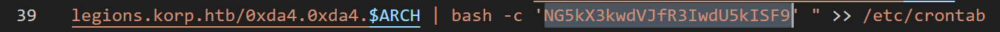

# It has Begun

So first of all download file and start analysis. After few seconds we will find reverse string with first part of flag. (14 line)

Dig deeper and find line with bash command, just decode it from base64 and receive second part.

## Flag : HTB{w1ll_y0u_St4nd_y0uR_Gr0uNd!!}
