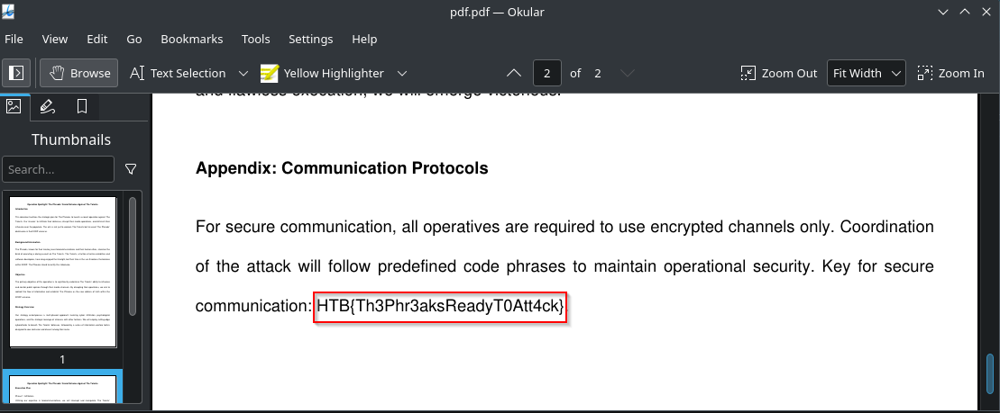

# Phreaky

So we have pcap file, first of all I extracted all IMF files (wireshark : File -> Export Objects -> IMF).

Our next step it's extract all base64 data from this *.eml files and convert it to zip archives. You can write for this script, but I did it manually.

```bash
echo '<base64 part>' | base64 -d > zip.zip
```

After that just unzip all archives using passwords inside eml files.

The last step is combine all parts in one file, for this purpose I wrote bash script : 

```bash
#!/bin/bash
for i in {1..15}
do
        cat phreaks_plan.pdf.part$i >> pdf.pdf
done
```

And finally just open it and get your flag and very end of file.


