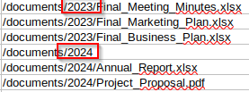
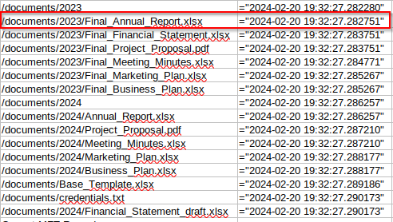
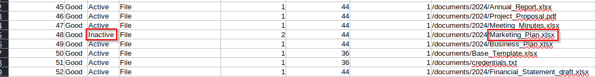
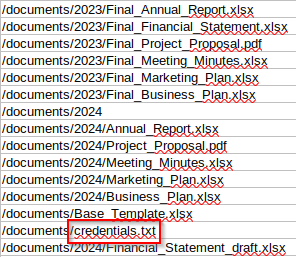
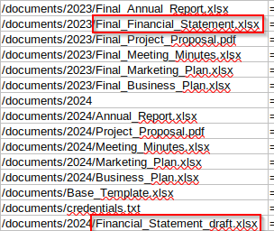
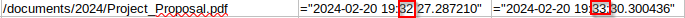
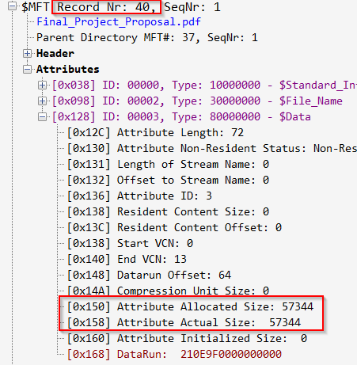

# Pursue The Tracks

Required tools :

- analyzeMFT.py 

- $MFT Record Viewer

```bash
analyzeMFT.py -f Desktop/z.mft -o output.csv
```

#### **Files are related to two years, which are those? (for example: 1993,1995)**



**2023,2024**                                                                                                                                     
[+] Correct!

#### There are some documents, which is the name of the first file written? (for example: randomname.pdf)



**Final_Annual_Report.xlsx**

[+] Correct! 

#### Which file was deleted? (for example: randomname.pdf)



**Marketing_Plan.xlsx**

[+] Correct!

#### How many of them have been set in Hidden mode? (for example: 43)

**1**

[+] Correct!

#### Which is the filename of the important TXT file that was created? (for example: randomname.txt)



**credentials.txt**

[+] Correct!

#### A file was also copied, which is the new filename? (for example: randomname.pdf)



Financial_Statement_draft.xlsx

[+] Correct!

#### Which file was modified after creation? (for example: randomname.pdf)



**Project_Proposal.pdf**

[+] Correct!

#### What is the name of the file located at record number 45? (for example: randomname.pdf)


**Annual_Report.xlsx**

[+] Correct!

#### What is the size of the file located at record number 40? (for example: 1337)



Now open $MFT Record Viewer and search 40 record.

**57344**

[+] Correct!

## Flag : HTB{p4rs1ng_mft_1s_v3ry_1mp0rt4nt_s0m3t1m3s}
