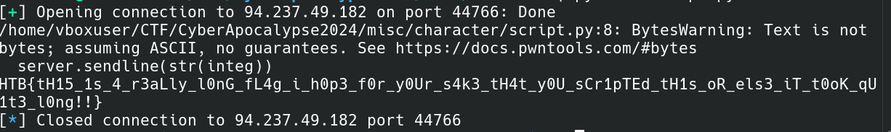

## Flag : HTB{tH15_1s_4_r3aLly_l0nG_fL4g_i_h0p3_f0r_y0Ur_s4k3_tH4t_y0U_sCr1pTEd_tH1s_oR_els3_iT_t0oK_qU

# 

# Character

So we just need get huge massive of characters, this task even can be completed manual, but i wrote script, which connecting to socket, decode string from bytes and add last character to flag.

## Flag : HTB{tH15_1s_4_r3aLly_l0nG_fL4g_i_h0p3_f0r_y0Ur_s4k3_tH4t_y0U_sCr1pTEd_tH1s_oR_els3_iT_t0oK_qU
