# Find The Compass

Immediately after launching the instance, we started discover it.


I didn't find anything particularly interesting here, so I went to analyze the source code.

The first thing I immediately noticed was that the website uses SQLITE, but also that it will not be susceptible to SQL Injection, since user authorization does not occur by executing an SQL query.

```python
@app.route('/login', methods=['POST'])
def login():
    try:
        username = request.json.get('username')
        password = request.json.get('password')
    except:
        return {"message": "Invalid request."}, 400
    user = User.query.filter_by(username=username).first()
    if user is None:
        return {"message": "User not found."}, 404
    if user.check_password(password):
        session['logged_in'] = True
        session['status'] = user.status
        session['username'] = user.username
        return {"message": "Login successful."}, 200
    else:
        return {"message": "Invalid credentials."}, 401
```

I continued to look into the routes file and discovered that the `/panel` page was being processed.

```python
@app.route('/panel', methods=['GET'])
def panel():
    if not authorized():
        return redirect(url_for('index'))
    reminders = Reminder.query.all()
    reminders_list = []
    # If a wise admin needs the coordinates of the compass, he can retrieve them.
    renderer = Renderer(COMPASS['COORDINATES'])
    for reminder in reminders:
        reminders_list.append([reminder.id, renderer.render(reminder.author.username , reminder.content)])
    return render_template('panel.html', reminders=reminders_list)
```

Here we can notice, that code check authorization of user, let's dig deeper and find `authorized()` function.

```python
def authorized() -> bool:
    """Check if the user is authorized"""
    return True if session.get('logged_in') == True and session.get('status') == 'admin' else False
```

So after this it becomes obvious to us that user authorization is carried out by checking the session cookie. Let's look at our session token.

`.eJwNzEEOhCAMBdC7dO0CESl4GVPaD5nE4AJcmbn7zDvAe-m6W4Odn05HlWtgoX53BR0EzsFVtweLZRe1uKljNu-RgCK5SikJSYN4VpdXbys2RZbooogyLTSmzGf8r_ZgTPr-AJ6DIoI.ZeI2KA.olaaG-ow5S2cCkzhqDW-fceQC2A`

So we already know, that website using Flask framework. That's mean, that we dealing with flask session. (For next steps we need [flask-unsign](https://github.com/Paradoxis/Flask-Unsign) tool). First of all let's decode the token.

```python
flask-unsign -d -c '.eJwNzEEOhCAMBdC7dO0CESl4GVPaD5nE4AJcmbn7zDvAe-m6W4Odn05HlWtgoX53BR0EzsFVtweLZRe1uKljNu-RgCK5SikJSYN4VpdXbys2RZbooogyLTSmzGf8r_ZgTPr-AJ6DIoI.ZeI2KA.olaaG-ow5S2cCkzhqDW-fceQC2A'
{'logged_in': False, 'nonce': 'e7940f054d6b5acd63c077d22e8eeba9fabb8e8c4a27c0912d1e3ce9a606aac7', 'status': 'guest'}
```

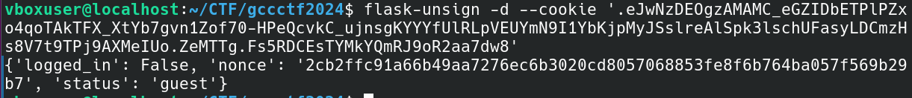

If we want to access the admin panel, perhaps our token should look like this :

```json
{
'logged_in': True,
'nonce': '<probably hash of instance>',
'status': 'admin'
}
```

But to create a fake token, we need to get the flask session secret, let's go back to the source code. Here is the secret generation code, in order to quickly understand what secret format we have, I suggest cutting out this piece of code and running it separately in order to draw a conclusion about the secret format based on visual assessments.

```python
def generate_key() -> str:
    """Generate a random key for the Flask secret (I love Python!)"""
    return (''.join([str(x) for x in [(int(x) ^ (int(time()) % 2 ^ randint(0, 2))) for x in [int(char) for char in str(digits[randint(0, 9)]) * 4]]])).rjust(8, '0')
```

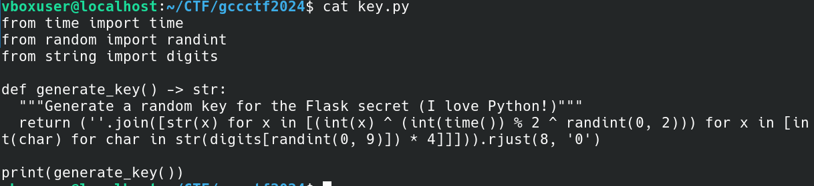

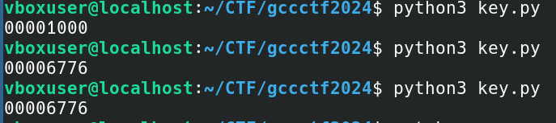

Our secret is probably in range from 00000000 to 99999999. For bruting the secret of our token, we need a wordlist, so let's generate one. ( For this purpose I used a `seq` tool )

```bash
vboxuser@localhost:~/CTF/gccctf2024$ seq -w 0 99999999 > keys
```

The last step in this part was a brute force of token. Let's use flags `--unsign`, `--wordlist`, `--no-literal-eval`.

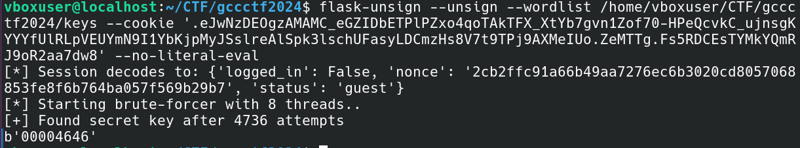

Congrats! Next, create a new token and get access to the panel.

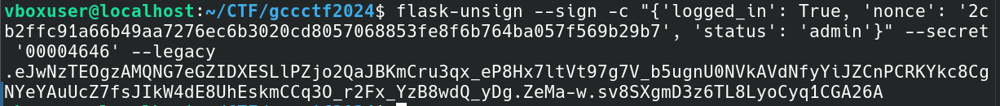

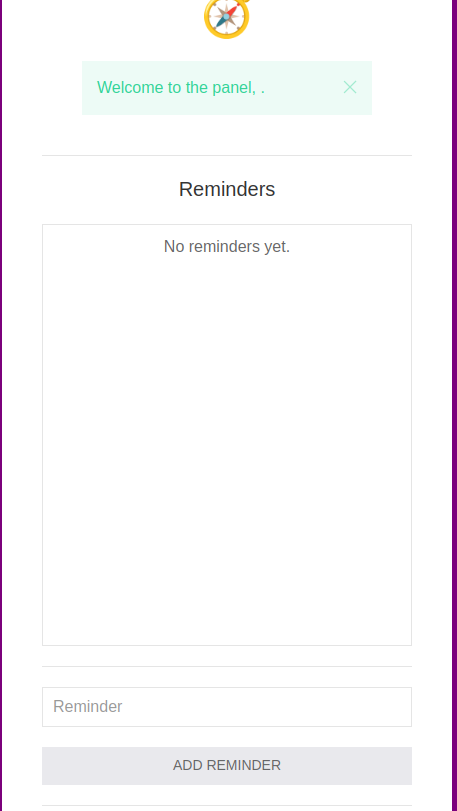

But when we try to use the functionality of the admin panel, we get a user error.

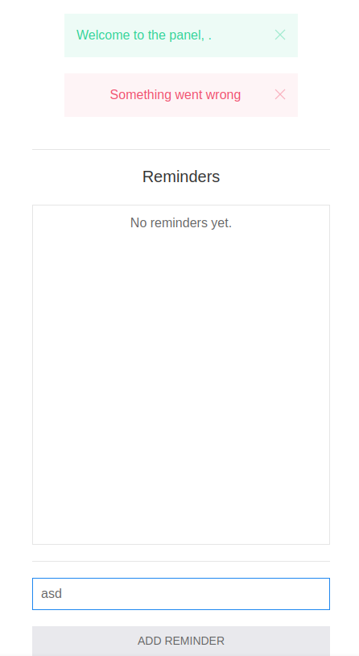

Most likely we need to regenerate the cookies and add the username field there. Let's go through this process.

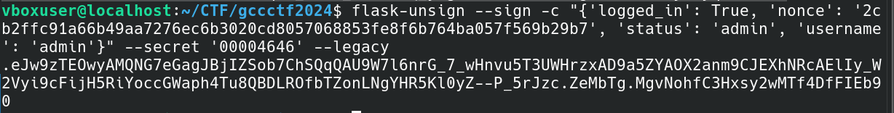

Great, the functionality worked!

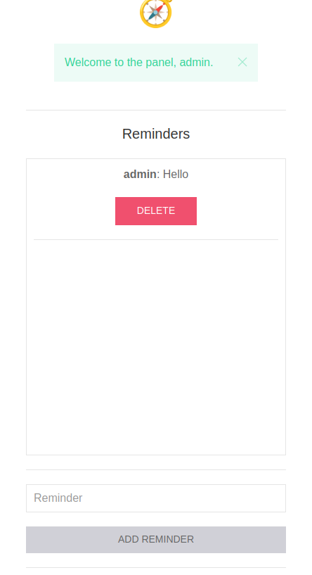

Once again let's look at the source code

```python
   ...
     COMPASS = {
    # Here are the coordinates of the compass.
    'COORDINATES': open('flag.txt', 'r').read()
    }
    renderer = Renderer(COMPASS['COORDINATES'])
    for reminder in reminders:
        reminders_list.append([reminder.id, renderer.render(reminder.author.username , reminder.content)])
    return render_template('panel.html', reminders=reminders_list))
```

Considering that Python uses render_template, we conclude that the application is most likely vulnerable to SSTI. However, the application does not use any third-party template generator, but its own:

```python
class Renderer(object):
    """
    Proof of Concept to one day get rid of Jinja2. Who needs Jinja2 ?
    """
    def __init__(self, coordinates: str):
        # Only a wise administrator can retrieve the coordinates of the compass.
        self.coordinates = coordinates

    def render(self, author, content):
        author = escape(author)
        content = escape(content)
        htmlTemplate = f"<p><strong>{author}</strong>: {content}</p>"
        try:
            #Use escape for XSS protection
            return (htmlTemplate.format(self=self))
        except Exception as e:
            print(e)
            return "An error occured while rendering the reminder."
```

We see that the coordinates (flag) are in self.coordinates and the template engine renders {<expression>} format, but given that this is its own generator, this means that it does not process classical mathematical operations, that is, the standard way of determining SSTI does not okay, let's try to process {self}

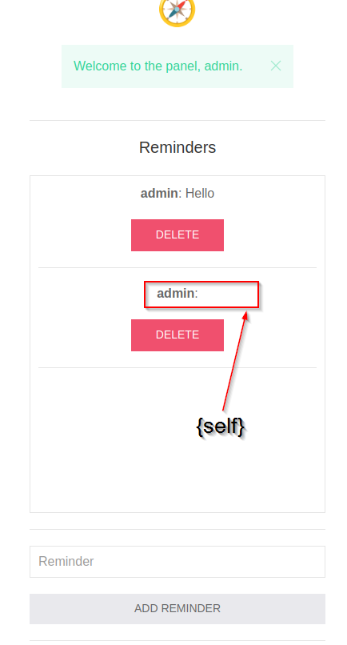

We see that the template engine has processed {self}, that is, we can get the flag by accessing {self.coordinates}!

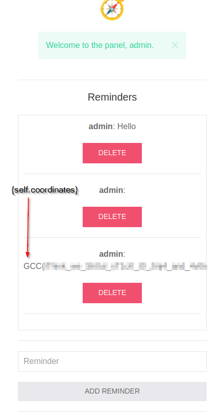

Congratulations!
